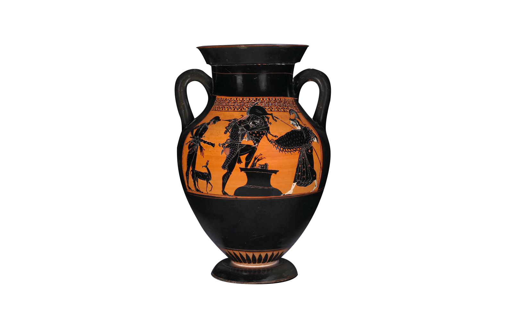

After visiting Pompeii early this year I got the curiosity bug and started a researching spree about ancient Roman amphorae, which eventually, as most things Roman, lead me to its Greek origin, _which in turn_ (bear with me, almost there…) lead me to this philosophical concept that the ancient Greeks possessed called <abbr title="Literally “beautiful and good”"><em>kalokagathos</em></abbr>.

Initially used by Aristotle – and later by other classical Greek writers – <em>kalokagathos</em> meant that the object or creation, beyond its practical utility, that is, being good, had to be also beautiful. Just as everything that was beautiful would also have to be of practical use.

**The concept of beauty was inseparably linked to the concept of use.**

The Greek amphorae is one of the better known examples of _kalokagathia_. Despite their daily use as storage for food and beverages, they also brought on their exterior paintings and drawings artistically worked, making them one of the most representative forms of Greek art.

---

It’s a pity that this concept is not widely taught in design schools all over the globe.

In this sea of products and services we navigate daily, we find products that clearly show a complete lack of care. They are painful and fustrating to use and there is always that feeling in the back of your head of “something is not quite right”.

What makes a well designed product shine is the careful thought and examination that goes behind it, it’s _kalokagathos_. 

It makes me wonder if we all start with an innate sense of what is good and beautiful? Maybe some lose it on the boring parts of everyday life? Maybe it’s only through nurturing our best thinking and interchanging ideas that we can turn it back into reality, into great products.

<small>¹ [Image source: The British Museum Collection](https://research.britishmuseum.org/research/collection_online/collection_object_details/collection_image_gallery.aspx?assetId=138013001&objectId=398888&partId=1)</small>
